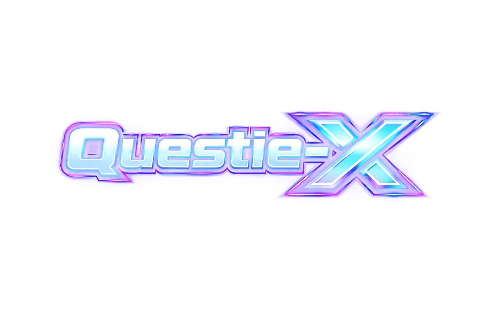

<div align="center">




[](https://github.com/Xurkon/Questie-X-AscensionDB/releases)
[](https://www.patreon.com/Xurkon)
[](https://www.paypal.me/Xurkon)
[](LICENSE)

<br/>

**A [Questie-X](https://github.com/Xurkon/Questie-X) plugin that injects the Ascension server database — custom quests, NPCs, objects, items, and zone data — into Questie without modifying core files.**

[Download Latest](https://github.com/Xurkon/Questie-X-AscensionDB/releases/latest) &nbsp;&bull;&nbsp; [View Source](https://github.com/Xurkon/Questie-X-AscensionDB)

</div>

---

## Requirements

- [Questie-X](https://github.com/Xurkon/Questie-X) must be installed. This plugin will not load without it.
- Server: Ascension (classless WoW — Elune, Area 52, Bronzebeard, Rexxar, Grizzly Hills, **CoA Beta on Vol'jin**)

---

## Installation

1. Download the latest release archive from the [Releases](https://github.com/Xurkon/Questie-X-AscensionDB/releases) page.
2. Extract it into your `Interface/AddOns/` directory.
3. The extracted folder **must** be named `Questie-X-AscensionDB`.
4. Ensure `Questie-X` is also present in `Interface/AddOns/`.
5. Reload your UI or restart the client.

Your addon list should look like:
```
Interface/AddOns/
  Questie-X/
  Questie-X-AscensionDB/
```

---

## What is Included

| File | Contents |
|------|----------|
| `Bronzebeard/AscensionNpcDB.lua` | Custom NPC data including spawn coordinates |
| `Bronzebeard/AscensionObjectDB.lua` | Custom object data |
| `Bronzebeard/AscensionItemDB.lua` | Custom item data |
| `Bronzebeard/AscensionQuestDB.lua` | Custom quest definitions |
| `Zones/AscensionUiMapData.lua` | UI map ID mappings for Ascension zones |
| `Zones/AscensionZoneTables.lua` | Zone table overrides |
| `AscensionLoader.lua` | Plugin entry point — registers data via `QuestiePluginAPI` |

---

## How It Works

`AscensionLoader.lua` calls `QuestiePluginAPI:RegisterPlugin("Ascension")` on load and passes the database tables as overrides. Questie-X merges them into its runtime database, giving full quest tracking, map pins, and tooltip support for Ascension-specific content. The plugin only activates on recognised Ascension realm names.

---

## Contributing

Submit quest data, NPC coordinates, or fixes via pull request. See the existing database files for the expected table format.

---

## License

MIT License